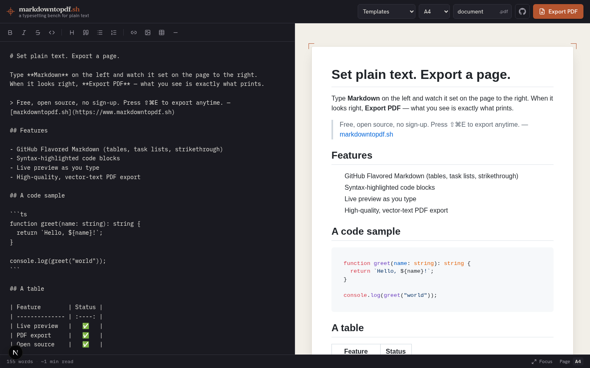

# markdowntopdf.sh

> Free &amp; open-source **Markdown → PDF**. Write Markdown with a live preview
> and download a polished, vector-quality PDF - no sign-up required.

An open-source take on [markdowntopdf.com](https://www.markdowntopdf.com),
built with a [readme.so](https://readme.so/editor)-style split editor.



## Features

- ✍️ **Live split editor** - Markdown on the left, instant preview on the right
- 🧰 **Formatting toolbar** - bold, italic, headings, links, images, code, tables, and more
- 📄 **High-quality PDF export** - real vector text, syntax-highlighted code, GitHub-style typography
- 🎛️ **Page options** - A4 / Letter / Legal / A3 and configurable margins
- 🧩 **Templates** - README, resume, and blank starters
- 💾 **Autosave** - your document is kept in `localStorage`
- 🔓 **No account needed** - optional Supabase integration adds cloud sync if you want it
- 🆓 **MIT licensed** - self-host it anywhere

## Quick start

```bash
git clone https://github.com/raj-khan/markdown.software
cd markdown.software
npm install
cp .env.example .env.local   # optional - see notes below
npm run dev
```

Open <http://localhost:3000>.

### Local PDF rendering

PDF generation uses a headless browser. **Locally**, the app auto-detects a
system Chrome/Chromium (e.g. `/usr/bin/google-chrome`). If yours lives
somewhere unusual, set it explicitly in `.env.local`:

```bash
CHROME_PATH=/path/to/google-chrome
```

**On Vercel / serverless**, it uses the bundled
[`@sparticuz/chromium`](https://github.com/Sparticuz/chromium) automatically -
no configuration needed.

## How it works

```
            ┌──────────────┐   shared unified pipeline   ┌──────────────┐
Markdown ─▶ │  src/lib/    │ ─────────────────────────▶ │ Live preview │
            │  markdown.ts │  (remark → rehype → HTML)   │  (client)    │
            └──────┬───────┘                             └──────────────┘
                   │ same HTML + same CSS
                   ▼
            ┌──────────────┐   Puppeteer (headless Chrome)   ┌─────────┐
            │ /api/pdf     │ ──────────────────────────────▶ │   PDF   │
            └──────────────┘                                 └─────────┘
```

The **exact same** Markdown→HTML pipeline and stylesheet drive both the
on-screen preview and the exported PDF, so what you see is what you download.

## Tech stack

| Layer       | Choice                                                |
| ----------- | ----------------------------------------------------- |
| Framework   | Next.js 16 (App Router) + React 19                    |
| Styling     | Tailwind CSS v4                                        |
| Markdown    | `unified` / `remark` / `rehype` (+ GFM, highlight.js) |
| PDF engine  | `puppeteer-core` + `@sparticuz/chromium`              |
| State       | `zustand` (with `localStorage` persistence)           |
| Auth (opt.) | Supabase                                              |
| Hosting     | Vercel (works anywhere Node runs)                     |

## Deploy

The app deploys to Vercel with zero config. Push to GitHub and import the
repo, or:

```bash
npm i -g vercel
vercel
```

No environment variables are required for the core tool. To enable accounts +
cloud-saved documents, add your Supabase keys (see [`.env.example`](.env.example))
and run [`supabase/schema.sql`](supabase/schema.sql).

## Roadmap

See [`PLAN.md`](PLAN.md) for the full architecture and phased rollout plan.

## Contributing

Contributions are very welcome - see [`CONTRIBUTING.md`](CONTRIBUTING.md).

## License

[MIT](LICENSE) © markdowntopdf.sh contributors
